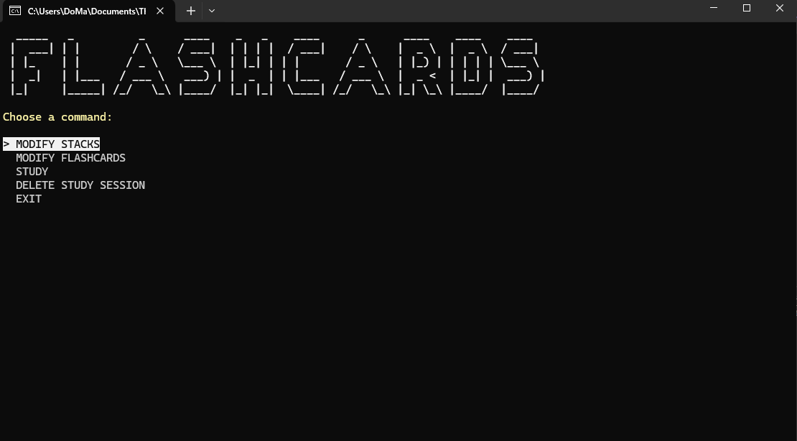

# Flashcard console app
Flashcard console App made using C#, Spectre Console, MSSQL. You can create different stacks of flashcards and then have study sessions to quiz your knowledge.
## Usage
To use the app, either launch it via the executable or run it using any IDE of your choice.
Choose an option from the dropdown corresponding to whatever command you want to run. You can INSERT, UPDATE, DELETE any flashcard or stack. Alternatively, you can launch a study session and delete study sessions.
## Motivation
This project was implemented as part of my roadmap to mastering .NET development.
## License
[MIT](https://choosealicense.com/licenses/mit/)